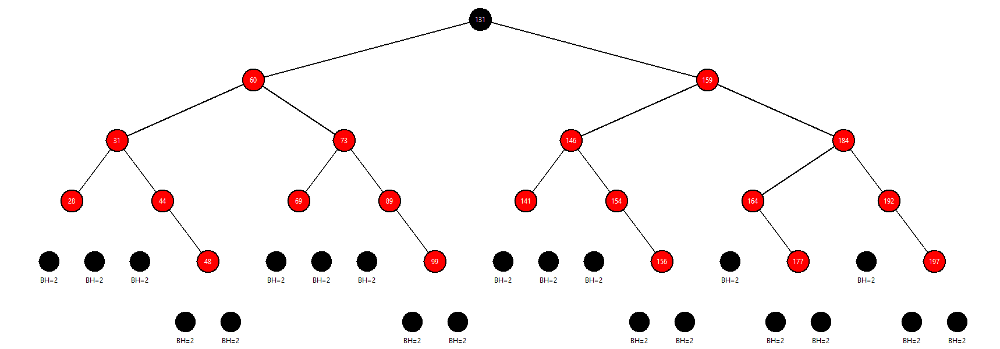

# Red-Black Tree Visualizer

A Python application that provides a visual and interactive representation of a Red-Black Tree (RBT), 
a balanced binary search tree that satisfies the Red-Black Tree properties.

## Features

- **Insert Nodes**: Add nodes to the tree and automatically rebalance using Red-Black Tree rules.
- **Delete Nodes**: Remove nodes from the tree with proper rebalancing.
- **Tree Traversals**:
  - Inorder
  - Preorder
  - Postorder
- **Manual Coloring**: Switch between red and black colors for nodes manually.
- **Rebalancing Modes**:
  - Full rebalancing with rotations and recoloring.
  - Simplified mode with coloring only.
- **Balanced Tree Generation**: Generate a perfectly or pseudo-balanced binary search tree.
- **Random Tree Generation**: Create random Red-Black Trees with adjustable node counts.
- **Validation**:
  - Check for Red-Black Tree properties: black-height consistency, root blackness, etc.
- **Theme Support**: Choose from classic, dark, and high-contrast themes.
- **Interactive UI**:
  - Display black heights of NIL nodes directly on the tree.
  - Tooltips show node details on hover.

## Installation

1. Clone this repository:

   ```bash
   git clone https://github.com/cagatay-softgineer/Red-Black-Tree-Visualizer.git
   cd Red-Black-Tree-Visualizer
   ```

2. Install the required dependencies:

   ```bash
   pip install -r requirements.txt
   ```

3. Run the application:

   ```bash
   python app.py
   ```

## Usage

1. Launch the app and use the control panel to:
   - Insert/Delete/Search nodes.
   - Generate random or balanced trees.
   - Toggle rebalancing modes and themes.
2. Click on nodes in manual coloring mode to toggle between red and black.
3. Validate the tree using the "Check RB Properties" button.

## Requirements

- Python 3.7 or later
- tkinter (built into Python)
- random (built into Python)
- asyncio 3.4.3 or later

## Development

### Folder Structure

```
.
├── app.py               # Main application code
├── requirements.txt     # List of dependencies
├── README.md            # Documentation
```

### Contributing

1. Fork the repository.
2. Create a feature branch (`git checkout -b feature-name`).
3. Commit your changes (`git commit -m "Add feature"`).
4. Push to the branch (`git push origin feature-name`).
5. Open a pull request.

### License

This project is licensed under the GPL License. See the [LICENSE](LICENSE) file for details.

## Screenshots

### Example Red-Black Tree Visualization



**Happy Visualizing!**
